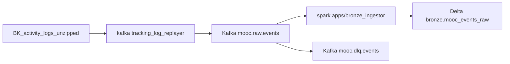

# Overall Architecture

Pipeline target: Kafka -> Spark Structured Streaming Bronze -> MinIO Delta Lake.

## Service Boundaries

- `kafka/`: ingest topic contract và producer replayer dữ liệu thật.
- `spark/`: business ETL, phân lớp domain/infrastructure/apps rõ ràng.
- `minio/`: object storage cho Delta tables, checkpoints và logs.
- `docker-compose.yaml`: compose orchestration local.
- `docs/`: chuẩn vận hành và design quyết định.

## Clean Architecture in Spark

- `apps/`: entrypoint job theo use case.
- `domain/`: logic ETL thuần nghiệp vụ (classify, normalize, dedup, aggregate).
- `infrastructure/`: Spark session, Kafka IO, Delta IO, path resolver.
- `configs/`: quy tắc classify/dedup/anomaly không hard-code.
- `utils/`: helper dùng chung.
