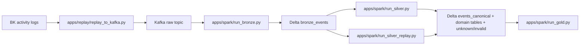

# Overall Architecture

Pipeline target: replay/file input -> Kafka raw topic -> LearnLake Bronze/Silver/Gold apps -> MinIO-backed Delta -> Trino/Superset serving.

## Silver Boundary

- Bronze preserves raw payloads.
- Silver owns semantic parsing, classification, quarantine, and replay.
- Gold must not reconstruct behavior by reparsing raw Bronze payloads.

## Silver Runtime

- One runtime only for Bronze -> Silver normalization:
  - Structured Streaming
  - `trigger(processingTime='10 seconds')`
  - `maxFilesPerTrigger=100`
- Replay is a separate bounded job for `silver_unknown_events`, not a second normalization runtime.
