# Overall Architecture

Pipeline target: Kafka -> Spark Structured Streaming -> MinIO Delta Lake theo medallion Bronze/Silver/Gold.

```mermaid
flowchart LR
    dataFiles[BK_activity_logs_unzipped] --> replayer[kafka tracking_log_replayer]
    replayer --> kafkaRaw[Kafka mooc.raw.events]
    kafkaRaw --> bronzeApp[spark apps/bronze_ingestor]
    bronzeApp --> bronzeDelta[Delta bronze.mooc_events_raw]
    bronzeDelta --> silverApp[spark apps/silver_transformer]
    silverApp --> silverTables[silver learning/performance/system/unknown/video_interactions]
    silverTables --> goldApp[spark apps/gold_aggregator]
    goldApp --> goldTables[gold user_learning/problem_performance/system_profile/video_anomaly_features]
    kafkaRaw --> dlq[Kafka mooc.dlq.events]
```

## Service Boundaries

- `kafka/`: ingest topic contract và producer replayer dữ liệu thật.
- `spark/`: business ETL, phân lớp domain/infrastructure/apps rõ ràng.
- `minio/`: object storage cho Delta tables và checkpoints.
- `infra-central/`: compose orchestration local.
- `docs/`: chuẩn vận hành và design quyết định.

## Clean Architecture in Spark

- `apps/`: entrypoint job theo use case.
- `domain/`: logic ETL thuần nghiệp vụ (classify, normalize, dedup, aggregate).
- `infrastructure/`: Spark session, Kafka IO, Delta IO, path resolver.
- `configs/`: quy tắc classify/dedup/anomaly không hard-code.
- `utils/`: helper dùng chung.
