# Overall Architecture

Pipeline target: replay/file input -> Kafka raw topic -> LearnLake Bronze/Silver/Gold apps -> MinIO-backed Delta -> Trino/Superset serving.

```mermaid
flowchart LR
    dataFiles[BK_activity_logs_unzipped] --> replayer[apps/replay/replay_to_kafka.py]
    replayer --> kafkaRaw[Kafka learnlake.daotao.raw]
    kafkaRaw --> bronzeApp[apps/spark/run_bronze.py]
    bronzeApp --> bronzeDelta[Delta bronze_events]
    bronzeDelta --> silverApp[apps/spark/run_silver.py]
    silverApp --> silverDelta[Delta silver_event_index + fact tables]
    silverDelta --> goldApp[apps/spark/run_gold.py]
```

## Responsibility Boundaries

- `src/learnlake/`: framework core.
- `catalog/`: source profiles, mappings, metrics, quality rules, and workflow definitions.
- `apps/`: thin runtime entrypoints.
- `projects/daotao_ai/`: use-case semantics, transforms, and use-case-specific Gold code.
- `platform/local/`: Kafka, Spark, MinIO, Hive Metastore, and shared platform assets.
- `orchestration/airflow/`: scheduling and maintenance DAGs.
- `serving/`: Trino and Superset assets.

## Canonical Layout Rule

The responsibility-first tree is the source of truth. New code must not restore top-level technology ownership such as `spark/`, `kafka/`, `airflow/`, `trino/`, or `superset/`.
