# Framework Architecture

Tài liệu này dùng để vẽ slide cho kiến trúc LearnLake theo mô hình:

1. `Framework Core`
2. `Source Pack / Use Case`
3. `Runtime Adapter`
4. `Platform / Infrastructure`

Nên trình bày theo thứ tự:

1. Slide 1: sơ đồ full luồng 4 layer
2. Slide 2: sơ đồ `module map` của LearnLake theo kiểu framework runtime
3. Slide 3: zoom vào `Framework Core`
4. Slide 4: zoom vào `Source Pack / daotao_ai`
5. Slide 5: zoom vào `Runtime Adapter`
6. Slide 6: zoom vào `Platform / Infrastructure`

## 0. Framework Module Map

Sơ đồ này chỉ mô tả **framework thuần** ở mức component. Nó bám gần hơn với code hiện có, không gắn với `daotao_ai`, và không đưa hạ tầng triển khai vào trong hình. Nó nên được đọc như một bản đồ module, không phải flowchart.

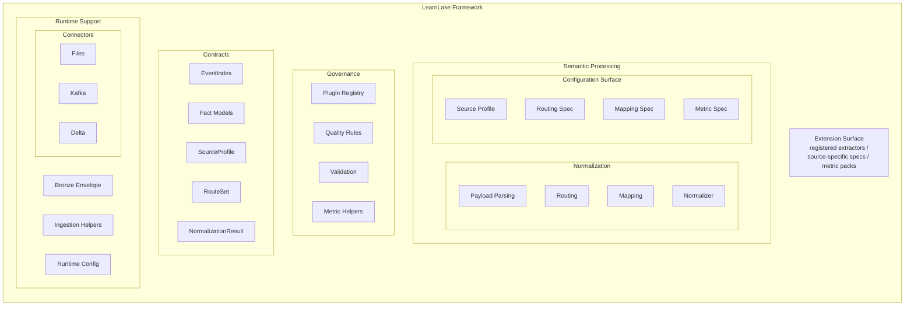

### Ý nghĩa sơ đồ module map

- `Contracts` là phần ổn định nhất của framework, dùng để giữ ngôn ngữ và boundary chung.
- `Normalization` là lõi semantic thực sự đang tồn tại trong code.
- `Configuration Surface` cho thấy framework được điều khiển bằng profile/spec thay vì hard-code.
- `Governance` gom các cơ chế kiểm soát như registry, quality rules, validation, metric helpers.
- `Runtime Support` gom các helper nền đang có thật trong code để framework đọc/ghi và giữ Bronze context ổn định.
- `Extension Surface` nhấn mạnh framework được mở rộng bằng registration và spec, không phải bằng sửa lõi.

### Cách nói ngắn cho slide

> LearnLake framework được tổ chức như một tập hợp component. Ở giữa là `contracts` và `normalization`, xung quanh là `configuration`, `governance`, `runtime support`, và `extension surface`. Cấu trúc này cho phép framework giữ generic, còn source-specific logic được cắm vào từ bên ngoài.

### Mapping Ngắn Với Source Code

- `Contracts` tương ứng với [src/learnlake/contracts](/home/cuong/Desktop/DATN/source/src/learnlake/contracts), là nơi định nghĩa `EventIndex`, fact models, `SourceProfile`, `RouteSet`, `NormalizationResult`.
- `Normalization` tương ứng với [src/learnlake/normalization](/home/cuong/Desktop/DATN/source/src/learnlake/normalization), là nơi parse payload, route event, evaluate mapping, và tạo output normalize.
- `Governance` tương ứng chủ yếu với [src/learnlake/plugins](/home/cuong/Desktop/DATN/source/src/learnlake/plugins), [src/learnlake/quality](/home/cuong/Desktop/DATN/source/src/learnlake/quality), và [src/learnlake/metrics](/home/cuong/Desktop/DATN/source/src/learnlake/metrics).
- `Configuration Surface` tương ứng với [src/learnlake/runtime/config.py](/home/cuong/Desktop/DATN/source/src/learnlake/runtime/config.py) và các YAML specs trong [catalog](/home/cuong/Desktop/DATN/source/catalog).
- `Runtime Support` tương ứng với [src/learnlake/connectors](/home/cuong/Desktop/DATN/source/src/learnlake/connectors), [src/learnlake/ingestion](/home/cuong/Desktop/DATN/source/src/learnlake/ingestion), và một phần [src/learnlake/runtime](/home/cuong/Desktop/DATN/source/src/learnlake/runtime).
- `Extension Surface` không phải là một package riêng; nó được hiện thực qua convention như source profiles trong `catalog/`, extractor registration trong `projects/<source>/transforms.py`, và metric declarations.

## 0.1 Pure Framework Architecture

Sơ đồ này chỉ giữ **framework thuần**. Nó không nhắc tới `daotao_ai`, không nhắc tới Kafka/MinIO/Spark cluster, và không gắn với bất kỳ use case cụ thể nào.

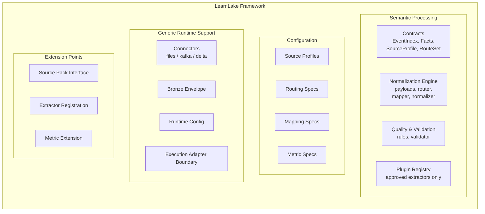

### Ý nghĩa sơ đồ pure framework

- `Contracts` tạo ngôn ngữ chung cho toàn framework.
- `Normalization Engine` là lõi semantic để hiểu event.
- `Quality & Validation` giữ chuẩn chất lượng dữ liệu sau normalize.
- `Plugin Registry` kiểm soát extension points thay vì cho phép gọi code tùy ý.
- `Configuration` cho phép framework được mô tả bằng profile/rules/specs thay vì hard-code.
- `Generic Runtime Support` là lớp hỗ trợ để framework có thể chạy trên backend khác nhau.
- `Extension Points` là nơi source pack hoặc metric pack cắm vào mà không sửa core.

### Cách nói ngắn cho slide

> LearnLake framework thuần gồm 4 nhóm năng lực: `semantic processing`, `configuration`, `generic runtime support`, và `extension points`. Phần này hoàn toàn không chứa logic của `daotao_ai` hay hạ tầng triển khai cụ thể.

## 0.2 Use Case Interaction With Framework

Sơ đồ này trả lời câu hỏi: **use case hiện tại `daotao_ai` đang cắm vào framework như thế nào**.

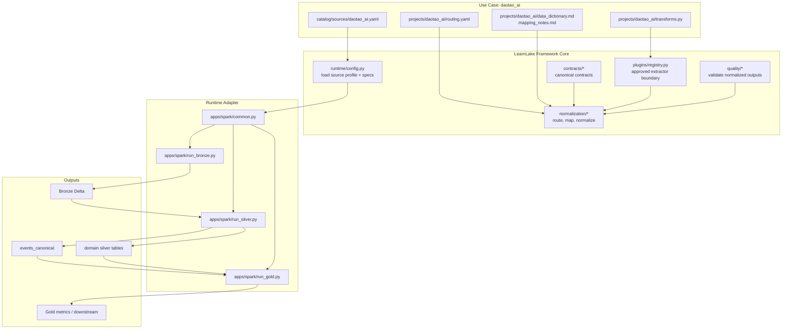

### Ý nghĩa sơ đồ tương tác

- `daotao_ai` không sửa trực tiếp framework core; nó chỉ cung cấp `source profile`, `routing rules`, và `extractors`.
- Framework core dùng các khai báo đó để hiểu event theo ngôn ngữ chung của LearnLake.
- Runtime adapter gọi framework core trong các job Bronze/Silver/Gold.
- Toàn bộ use case hiện tại đang đi đúng theo mô hình `source pack cắm vào framework`, không phải `hard-code trực tiếp vào core`.

## 0.3 Repo Map And Purpose

Phần này dùng khi cần giải thích repo ở mức tổ chức tổng thể.

```text
repo/
├── src/
│   └── learnlake/            # Framework để có thể reuse
│       ├── contracts/        # Lõi schema và boundary chung của framework
│       ├── runtime/          # Load config và bọc backend/runtime concerns
│       ├── connectors/       # IO helpers cho file, Kafka, Delta
│       ├── ingestion/        # Chuẩn hóa raw ingest trước Silver
│       ├── normalization/    # Engine parse, route, map, normalize event
│       ├── quality/          # Rule và validator cho chất lượng dữ liệu
│       ├── metrics/          # Helper logic cho metric/gold layer
│       └── plugins/          # Registry kiểm soát extractor/plugin được phép chạy
│
├── catalog/
│   ├── sources/              # Source profiles khai báo mỗi source chạy ra sao
│   ├── mappings/             # Mapping specs từ raw fields sang canonical fields
│   ├── event_types/          # Taxonomy/event-type definitions hỗ trợ phân loại
│   ├── quality/              # Quality rule specs theo common/source
│   └── metrics/              # Metric declarations cho gold/downstream
│
├── apps/
│   ├── spark/                # Runtime adapter hiện tại cho Bronze/Silver/Gold
│   └── replay/               # Tool replay/local ingest ngoài pipeline chính
│
├── projects/
│   └── daotao_ai/            # Source pack daotao_ai
│
├── tests/
│   ├── contract/             # Kiểm tra boundary/framework contract
│   ├── unit/                 # Kiểm tra logic nhỏ: router, payloads, validator...
│   ├── integration/          # Kiểm tra vertical slice framework + source pack
│   └── fixtures/             # Dữ liệu mẫu phục vụ test
│
├── docs/                     # Tài liệu kiến trúc, runbook, design notes
└── docker-compose.yaml       # Entry point dựng local platform end-to-end
```

### Cách giải thích repo ngắn gọn

- `src/learnlake` là **framework core thực sự**.
- `catalog` là nơi chứa **khai báo để framework hiểu source và rules**.
- `projects/daotao_ai` là **use case pack đầu tiên**.
- `apps/spark` là **runtime adapter** đang dùng để chạy framework.
- `tests` là nơi chứng minh framework và source pack hoạt động đúng.
- `kafka`, `minio`, `airflow`, `trino`, `superset`, `hive-metastore` là **platform layer đang active**, không phải code cũ đã bỏ.
- `spark/` là trường hợp chuyển tiếp: phần image/runtime packaging vẫn đang dùng thật, còn nhiều thư mục con bên trong là **legacy Spark code** chưa dọn sạch hoàn toàn.

## 1. Full 4-Layer Architecture

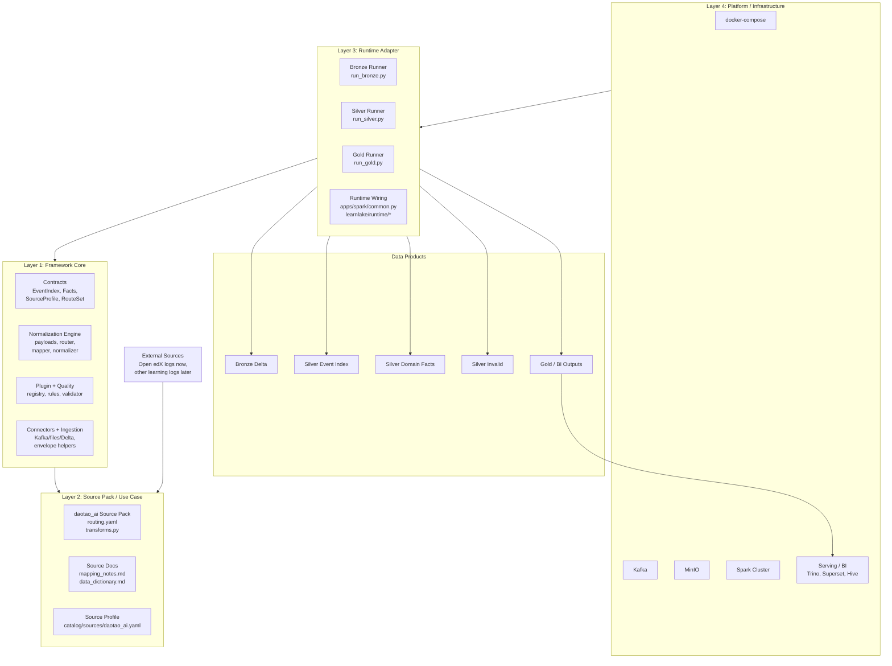

### Ý nghĩa sơ đồ full

- `Framework Core` là lõi generic, không được chứa logic đặc thù Open edX hay `daotao_ai`.
- `Source Pack` là nơi chứa toàn bộ semantics của nguồn dữ liệu cụ thể.
- `Runtime Adapter` là lớp thực thi framework trên Spark.
- `Platform / Infrastructure` là môi trường chạy local hoặc production-like.
- `Silver` không còn là một bảng duy nhất, mà là `event index + domain fact tables`.
- Cách đọc sơ đồ này nên là: `Platform -> Runtime -> Framework Core -> Source Pack`, còn dữ liệu đi từ `External Sources -> Source Pack -> Framework/Core/Runtime -> Data Products`.

## 1.1 Full 4-Layer Architecture With Folder View

Sơ đồ này dùng cho trường hợp bạn muốn vừa nói về layer, vừa chỉ ngay vị trí folder trong repo.

```mermaid
flowchart TB
    %% Full architecture with coarse-grained folder layout

    subgraph SRC["Input / Data Sources"]
        SRC1["Open edX tracking logs"]
        SRC2["Future sources\nAPI / files / xAPI / Moodle / EdNet"]
    end

    subgraph CORE["Layer 1 - Framework Core"]
        CORE1["src/learnlake/contracts/\n# data contracts"]
        CORE2["src/learnlake/normalization/\n# routing + payload parsing + normalization"]
        CORE3["src/learnlake/plugins/\n# approved extractor registry"]
        CORE4["src/learnlake/quality/\n# validation and invalid routing"]
        CORE5["src/learnlake/runtime/\n# config loading and Spark builder"]
        CORE6["src/learnlake/ingestion/\n# bronze envelope helpers"]
        CORE7["src/learnlake/connectors/\n# Kafka/files/Delta IO helpers"]
        CORE8["src/learnlake/metrics/\n# metric helpers"]
    end

    subgraph USECASE["Layer 2 - Source Pack / Use Case"]
        USE1["projects/daotao_ai/\n# Open edX-specific rules and extractors"]
        USE2["catalog/sources/daotao_ai.yaml\n# source profile"]
    end

    subgraph RUNTIME["Layer 3 - Runtime Adapter"]
        RUN1["apps/spark/\n# Bronze/Silver/Gold entrypoints"]
    end

    subgraph PLATFORM["Layer 4 - Platform / Infrastructure"]
        PL1["docker-compose.yaml\n# local orchestration"]
        PL2["kafka/\n# topic bootstrap + replay tools"]
        PL3["minio/\n# S3-compatible storage runtime"]
        PL4["Spark cluster services\n# spark-master / workers from compose runtime"]
        PL5["trino/ + superset/ + hive-metastore/\n# query and BI layer"]
        PL6["airflow/\n# orchestration layer"]
    end

    subgraph OUTPUT["Outputs"]
        OUT1["Bronze Delta"]
        OUT2["Silver Event Index"]
        OUT3["Silver Domain Facts"]
        OUT4["Silver Invalid"]
        OUT5["Gold / Serving"]
    end

    SRC1 --> USE1
    SRC2 --> CORE1

    USE2 --> CORE5
    USE1 --> CORE2
    USE1 --> CORE3

    CORE7 --> CORE6
    CORE6 --> RUN1
    CORE1 --> RUN1
    CORE2 --> RUN1
    CORE3 --> RUN1
    CORE4 --> RUN1
    CORE5 --> RUN1
    CORE8 --> RUN1

    PL1 --> PL2
    PL1 --> PL3
    PL1 --> PL4
    PL1 --> PL5
    PL1 --> PL6
    PL2 --> RUN1
    PL3 --> RUN1
    PL4 --> RUN1

    RUN1 --> OUT1
    RUN1 --> OUT2
    RUN1 --> OUT3
    RUN1 --> OUT4
    RUN1 --> OUT5
```

### Cách nói cho sơ đồ full có folder

- `src/learnlake` là framework core thực sự.
- `projects/daotao_ai` và `catalog/sources/daotao_ai.yaml` là use case cụ thể.
- `apps/spark` là lớp chạy framework trên Spark.
- `docker-compose`, `kafka`, `minio`, Spark services trong compose, `trino`, `superset`, `hive-metastore`, `airflow` là platform layer.
- Khi nói ở mức repo, chỉ cần nhớ: `core`, `use case`, `runtime`, `platform`.

## 1.2 Folder Summary By Layer

```text
Layer 1 - Framework Core
  src/learnlake/
  # Lõi generic: contracts, normalization, quality, plugin boundary, connectors, config

Layer 2 - Source Pack / Use Case
  projects/daotao_ai/
  catalog/sources/
  # Semantics đặc thù source và source profile

Layer 3 - Runtime Adapter
  apps/spark/
  # Runner thực thi Bronze/Silver/Gold bằng Spark

Layer 4 - Platform / Infrastructure
  kafka/
  minio/
  airflow/
  trino/
  superset/
  hive-metastore/
  docker-compose.yaml
  # Queue, object store, Spark services, orchestration, query, dashboard
```

## 2. Layer 1: Framework Core

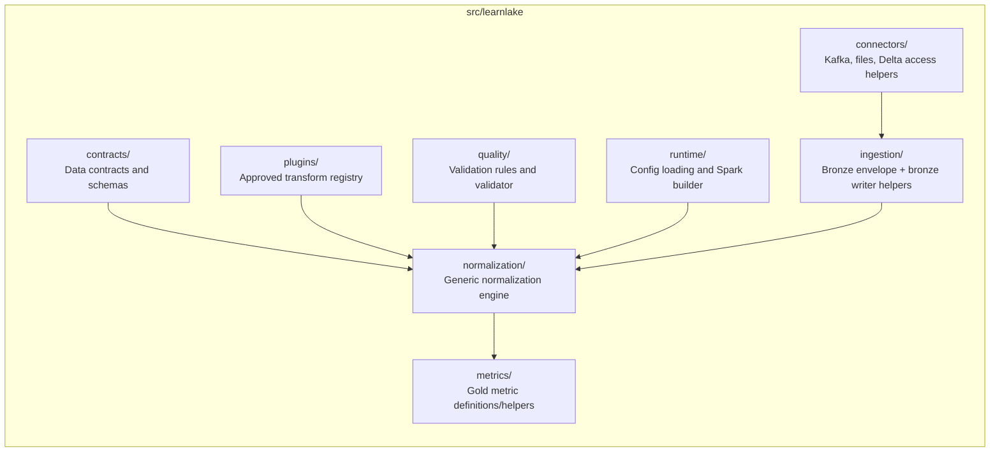

### Folder/File Trong Framework Core

```text
src/learnlake/
├── contracts/
│   ├── event_index.py        # Giữ identity và lineage chung cho mọi event
│   ├── facts.py              # Ép Silver domain data về typed schema ổn định
│   ├── source.py             # Cố định hợp đồng cấu hình giữa source và runtime
│   ├── routing.py            # Chuẩn hóa DSL route để source pack không mô tả tùy ý
│   ├── normalization.py      # Chốt đầu ra chuẩn của bước normalize
│   ├── quality.py            # Giữ ngôn ngữ chung cho chất lượng dữ liệu
│   ├── mapping.py            # Chuẩn hóa cách map raw field sang canonical field
│   ├── bronze.py             # Giữ cấu trúc raw envelope thống nhất
│   └── metric.py             # Cố định contract cho lớp metric/gold
├── normalization/
│   ├── payloads.py           # Tách xử lý payload đa dạng khỏi source-specific code
│   ├── router.py             # Cung cấp cơ chế phân loại generic dùng lại được
│   ├── mapper.py             # Giữ mapping logic ở core thay vì rải trong runner
│   ├── resolver.py           # Cho phép mở rộng resolution mà không đổi pipeline
│   ├── values.py             # Gom helper truy cập field để tránh lặp logic
│   └── normalizer.py         # Điều phối một lifecycle normalize thống nhất
├── plugins/
│   └── registry.py           # Tạo boundary an toàn giữa YAML và code extractor
├── quality/
│   ├── rules.py              # Giữ quality rule ở dạng khai báo được
│   └── validator.py          # Tách kiểm tra chất lượng khỏi extractor
├── runtime/
│   ├── config.py             # Biến YAML declarations thành runtime objects hợp lệ
│   └── spark.py              # Gói Spark/object-store như một backend adapter
├── ingestion/
│   ├── envelope.py           # Chuẩn hóa raw ingest trước khi vào semantic layers
│   └── bronze_writer.py      # Tách logic ghi Bronze khỏi entrypoint
├── connectors/
│   ├── kafka.py              # Tách cách đọc stream khỏi source semantics
│   ├── files.py              # Cho framework chạy được cả file/fixture/local mode
│   └── delta.py              # Gom IO Delta để runtime có thể reuse dần
└── metrics/
    └── course_activity.py    # Giữ metric logic tách khỏi normalization layer
```

### Giải thích Layer 1

`Framework Core` là phần quan trọng nhất của LearnLake.

Ý nghĩa của layer này là:

1. Tạo ngôn ngữ chung cho toàn framework
2. Cố định boundary giữa generic core và source-specific logic
3. Ngăn schema drift giữa nhiều source và nhiều runtime
4. Cho phép thay source pack mà không viết lại pipeline
5. Giữ semantic logic tách khỏi hạ tầng chạy

Điểm cần nhấn mạnh trong slide:

- Đây là phần generic nhất.
- Mọi source mới đều phải đi qua core này.
- Core không biết `problem_check`, `play_video`, `textbook.pdf.*`.

## 2.1 Framework Core Ở Mức Folder

Nếu trình bày theo slide riêng, có thể tách 1 sơ đồ chỉ nói về các folder trong core:

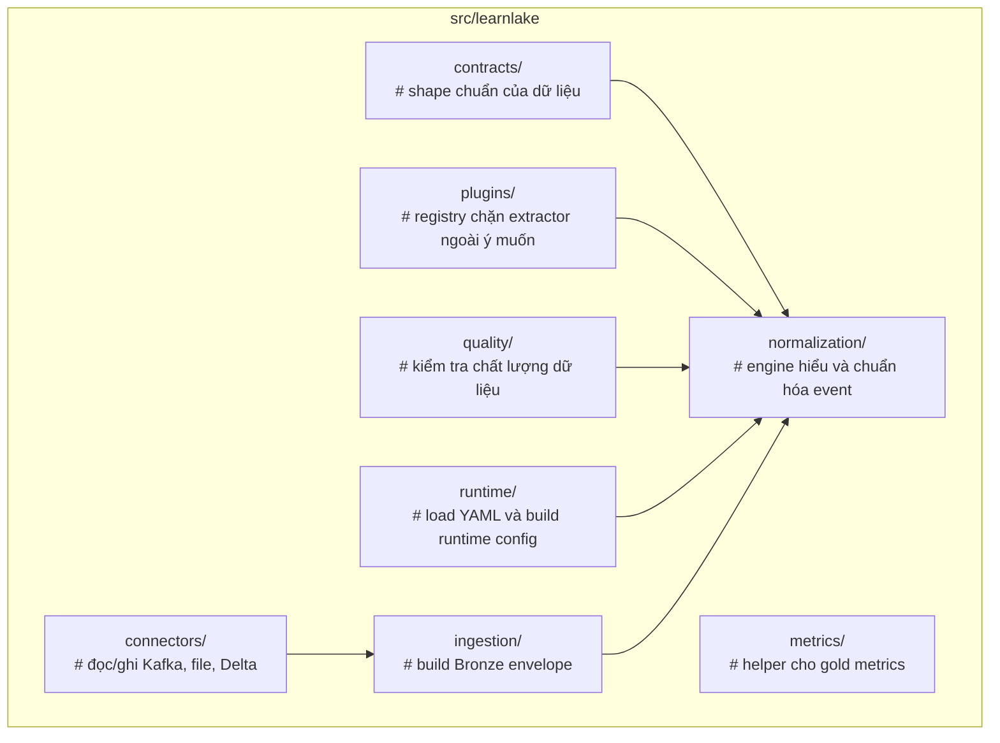

### Giải thích logic tổng thể của Framework Core

Framework core hoạt động như một pipeline logic nhiều bước:

```text
raw bronze record
  -> parse payload
  -> match route
  -> evaluate mapping
  -> build event index
  -> validate quality
  -> call extractor
  -> emit event index + zero or more fact rows + invalid rows
```

Điểm quan trọng nhất là:

- Core không xử lý theo kiểu `if/else` cứng cho từng event Open edX.
- Core xử lý theo kiểu:
  - đọc `SourceProfile`
  - đọc `RouteSet`
  - đọc `MappingSpec`
  - gọi extractor đã đăng ký
- Như vậy core có thể tái sử dụng cho nhiều source khác nhau.

## 2.2 Giải Thích Sâu Từng Nhóm Trong Framework Core

### A. `contracts/`

Đây là nơi định nghĩa các “kiểu dữ liệu chuẩn” của toàn bộ framework.

Vai trò:

- ép mọi output phải có cấu trúc rõ ràng
- giảm việc truyền `dict` vô tổ chức giữa các lớp
- làm nền cho validation và schema generation

Những file quan trọng:

- [event_index.py](/home/cuong/Desktop/DATN/source/src/learnlake/contracts/event_index.py)
  - định nghĩa `EventIndex`
  - đây là row canonical chung cho mọi event hợp lệ đi vào Silver
  - chứa:
    - lineage
    - actor/session/course context
    - normalized semantics
    - quality status
    - payload summary

- [facts.py](/home/cuong/Desktop/DATN/source/src/learnlake/contracts/facts.py)
  - định nghĩa các fact table typed theo domain
  - ví dụ:
    - `AssessmentEvent`
    - `VideoEvent`
    - `DocumentEvent`
    - `NavigationEvent`
    - `ExamEvent`
  - đây là phần giúp Silver analytics-ready thay vì giữ hết JSON thô

- [source.py](/home/cuong/Desktop/DATN/source/src/learnlake/contracts/source.py)
  - định nghĩa `SourceProfile`
  - đây là contract mô tả một source cần gì để chạy
  - nó gom:
    - input config
    - bronze config
    - silver event index config
    - silver target configs
    - invalid output config
    - routing reference
    - quality rules reference

- [routing.py](/home/cuong/Desktop/DATN/source/src/learnlake/contracts/routing.py)
  - định nghĩa DSL cho route
  - có:
    - `RouteMatch`
    - `RouteSpec`
    - `RouteSet`
  - đây là lớp mô hình hóa declarative routing rules

- [normalization.py](/home/cuong/Desktop/DATN/source/src/learnlake/contracts/normalization.py)
  - định nghĩa:
    - `FactRecord`
    - `NormalizationResult`
    - `BatchNormalizationResult`
  - đây là contract cho kết quả normalize đa target

Tại sao phần `contracts/` quan trọng:

- nếu không có nó, framework sẽ biến thành tập hợp script truyền `dict` lỏng lẻo
- rất khó verify schema
- rất khó thay source hoặc backend

### B. `normalization/`

Đây là trung tâm xử lý semantic của framework.

Các file chính và logic:

- [payloads.py](/home/cuong/Desktop/DATN/source/src/learnlake/normalization/payloads.py)
  - chuẩn hóa field `event`
  - vì Open edX có thể đưa `event` ở nhiều dạng:
    - dict
    - JSON string
    - list
    - form-urlencoded string
    - invalid payload
  - bước này biến payload thô thành dạng mà router và extractor có thể dùng

- [router.py](/home/cuong/Desktop/DATN/source/src/learnlake/normalization/router.py)
  - nhận `RouteSet`
  - sort route theo `priority`
  - duyệt route theo first-match deterministic
  - hỗ trợ operators như:
    - `equals`
    - `in`
    - `starts_with`
    - `contains`
    - `regex`
    - `has_key`
    - `all`
    - `any`
    - `not`

- [mapper.py](/home/cuong/Desktop/DATN/source/src/learnlake/normalization/mapper.py)
  - lấy mapping spec và evaluate field values
  - nhiệm vụ của mapper là build common output fields cho `EventIndex`
  - ví dụ:
    - `actor_id`
    - `course_id`
    - `raw_name`
    - `normalized_type`
    - `payload_kind`

- [normalizer.py](/home/cuong/Desktop/DATN/source/src/learnlake/normalization/normalizer.py)
  - đây là orchestration function quan trọng nhất
  - nó thực hiện tuần tự:
    1. lấy `raw_payload`
    2. parse `event`
    3. route match
    4. mapping common fields
    5. build `EventIndex`
    6. validate quality
    7. nếu hợp lệ thì gọi extractor
    8. trả về:
       - `event_index`
       - `facts`
       - `invalid_records`
  - đây chính là trái tim của bước Silver normalize

- [resolver.py](/home/cuong/Desktop/DATN/source/src/learnlake/normalization/resolver.py)
  - hỗ trợ resolve event type map hoặc các mapping phụ trợ

- [values.py](/home/cuong/Desktop/DATN/source/src/learnlake/normalization/values.py)
  - helper đọc nested path trong record
  - ví dụ đọc `bronze.raw_payload.context.user_id`
  - tránh việc mọi chỗ tự parse path string bằng tay

Điểm kiến trúc cần nhấn mạnh:

- `normalization/` không biết source cụ thể
- nó chỉ biết:
  - route rules
  - mappings
  - plugin registry
- vì vậy nó generic

### C. `plugins/`

File chính:

- [registry.py](/home/cuong/Desktop/DATN/source/src/learnlake/plugins/registry.py)

Vai trò:

- đăng ký extractor functions theo string name
- chỉ những extractor đã register mới được router gọi

Tại sao cần registry:

- tránh YAML import Python tùy ý
- kiểm soát boundary giữa generic core và source-specific code
- dễ test và dễ thay extractor

Mô hình logic:

```text
route.yaml
  -> extractor = "daotao_extract_video"
  -> registry.get("daotao_extract_video")
  -> call approved function
```

### D. `quality/`

File chính:

- [rules.py](/home/cuong/Desktop/DATN/source/src/learnlake/quality/rules.py)
- [validator.py](/home/cuong/Desktop/DATN/source/src/learnlake/quality/validator.py)

Vai trò:

- nhận `EventIndex` record sau normalize
- kiểm tra rule chất lượng
- nếu lỗi thì:
  - gắn `quality_status`
  - ghi `quality_errors`
  - route sang `silver_invalid_events`

Ý nghĩa:

- ngăn event lỗi làm hỏng fact tables
- giúp trace record nào không đạt chất lượng

### E. `runtime/`

File chính:

- [config.py](/home/cuong/Desktop/DATN/source/src/learnlake/runtime/config.py)
- [spark.py](/home/cuong/Desktop/DATN/source/src/learnlake/runtime/spark.py)

Vai trò:

- `config.py`
  - load YAML:
    - source profile
    - route set
    - mapping spec
    - quality rules
    - metric definitions
  - resolve relative path -> absolute repo path

- `spark.py`
  - build `SparkSession`
  - lấy config object store qua env
  - giữ Spark runtime config tách khỏi business logic normalize

Ý nghĩa:

- `runtime/` là lớp bridge giữa config ngoài đời thực và framework logic

### F. `ingestion/`

Vai trò:

- build Bronze envelope từ raw source payload
- chuẩn hóa metadata ingest:
  - `event_id`
  - `source_id`
  - `ingestion_time`
  - `kafka topic/partition/offset`

Nó phục vụ Bronze, nhưng là một phần của core vì envelope logic phải nhất quán cho mọi source.

### G. `connectors/`

Vai trò:

- gom IO helpers lại một chỗ
- tránh để runtime code tự nói chuyện trực tiếp với Kafka/files/Delta một cách lộn xộn

Ý nghĩa:

- giúp core và runtime có lớp truy cập dữ liệu rõ ràng

### H. `metrics/`

Vai trò:

- chứa helper logic cho metrics/gold
- hiện chưa phải phần lớn nhất của framework, nhưng là nơi đặt shared metric logic nếu nhiều use case cùng dùng

## 2.3 Cách Kể Chuyện Logic Trong Framework Core

Nếu phải giải thích sâu trong slide, có thể đi theo thứ tự này:

1. `contracts` định nghĩa output framework phải trông như thế nào
2. `runtime/config` đọc source profile để biết source cần gì
3. `normalization/payloads` parse payload về dạng chuẩn
4. `normalization/router` quyết định event thuộc nhóm nào
5. `normalization/mapper` điền common fields cho `EventIndex`
6. `quality/validator` chặn record lỗi
7. `plugins/registry` gọi extractor đúng source pack
8. extractor trả về typed fact rows
9. `NormalizationResult` trả ra `event_index + facts + invalid`

Đây là điểm khác biệt lớn nhất so với cách làm cũ một bảng Silver:

- trước đây:
  - normalize vào một bảng generic
  - Gold phải parse JSON lại
- bây giờ:
  - normalize vào `event index + typed facts`
  - Gold đọc trực tiếp các domain tables

## 2.1 Framework Core Logic Deep Dive

Phần này giải thích sâu hơn `Framework Core` hoạt động như thế nào ở mức code và logic.

### a. `contracts/` được viết như lớp schema chuẩn

Các file trong `contracts/` chủ yếu dùng `pydantic BaseModel` hoặc `dataclass`.

Chúng không chứa business logic phức tạp. Vai trò chính là:

- định nghĩa input shape
- định nghĩa output shape
- tạo validation boundary
- tạo contract giữa framework core, source pack và runtime

Các file quan trọng:

- [event_index.py](/home/cuong/Desktop/DATN/source/src/learnlake/contracts/event_index.py)
  - định nghĩa `EventsCanonical`
  - đây là row chuẩn classified-event chung cho mọi event sau Silver
  - chứa stable event identity, event time, actor, course, route classification, payload summary

- [facts.py](/home/cuong/Desktop/DATN/source/src/learnlake/contracts/facts.py)
  - định nghĩa fact model theo domain
  - mỗi domain là một typed schema riêng thay vì nhét hết vào một bảng rộng
  - đây là nền tảng cho kiến trúc `events_canonical + domain facts`

- [source.py](/home/cuong/Desktop/DATN/source/src/learnlake/contracts/source.py)
  - định nghĩa `SourceProfile`
  - một source profile mô tả:
    - input đọc từ đâu
    - Bronze path nào
    - canonical, unknown, invalid, và domain Silver path nào
    - có những Silver target nào
    - routing file nào
    - parser file nào
    - quality rules nào

- [routing.py](/home/cuong/Desktop/DATN/source/src/learnlake/contracts/routing.py)
  - định nghĩa DSL cho route rules
  - `RouteMatch` là toán tử match
  - `RouteSpec` là một luật route đầy đủ
  - `RouteSet` là tập route cho source pack

- [normalization.py](/home/cuong/Desktop/DATN/source/src/learnlake/contracts/normalization.py)
  - định nghĩa output contract của normalization engine
  - `NormalizationResult` cho một record
  - `BatchNormalizationResult` cho một batch

Nói ngắn gọn:

> `contracts/` là ngôn ngữ chung của framework.

### b. `silver/` và `silver_domain/` là bộ máy xử lý chính

Đây là phần quan trọng nhất trong logic Silver mới.

#### [runtime.py](/home/cuong/Desktop/DATN/source/src/learnlake/silver/runtime.py)

Nhiệm vụ:

- compile route, parser, quality config trên driver
- dựng DataFrame plan cho shared transforms và domain parsers
- tách canonical, unknown, invalid, và domain outputs

Luồng logic của một Bronze batch:

```text
1. parse base fields từ raw payload
2. parse context fields
3. derive event_id và auth flags
4. attach route classification theo routing.yaml
5. split thành matched, unknown, invalid
6. build events_canonical cho matched valid rows
7. apply parser DataFrame functions cho từng parser family
8. emit canonical + domain tables + unknown + invalid
```

Điểm thiết kế quan trọng:

- driver chỉ compile config và orchestrate Spark plan
- worker mới thực thi parse, classify, transform
- không còn per-row Python routing hay mapper hot path

#### [compiler.py](/home/cuong/Desktop/DATN/source/src/learnlake/silver/compiler.py)

Nhiệm vụ:

- compile `routing.yaml` thành Spark `Column` expressions
- support deterministic operator set:
  - `eq`
  - `in`
  - `regex`
  - `contains`
  - `startswith`
  - `exists`
  - `all`
  - `any`
  - `not`

Ý nghĩa:

> semantics nằm trong YAML, còn compiler chỉ biến nó thành Spark expressions chạy trên worker.

#### [transforms.py](/home/cuong/Desktop/DATN/source/src/learnlake/silver_domain/transforms.py)

Nhiệm vụ:

- shared Spark DataFrame functions:
  - `parse_base_fields`
  - `parse_context_fields`
  - `parse_authentication_flags`
  - `attach_event_identity`
  - `attach_route_fields`
  - `build_events_canonical`
  - `build_unknown_events`
  - `build_invalid_events`
- domain parser Spark DataFrame functions:
  - `parse_problem_check_browser`
  - `parse_problem_check_server`
  - `parse_problem_grade`
  - `parse_special_exam_attempt`
  - `parse_video_interaction`
  - `parse_transcript_request`
  - `parse_navigation_event`
  - `parse_content_access_event`
  - `parse_auth_noise_event`
  - `parse_system_noise_event`

Ý nghĩa:

> parser nhận và trả về Spark DataFrame, không materialize Python row object.

### c. `plugins/` là boundary kiểm soát code mở rộng

File chính:
- [registry.py](/home/cuong/Desktop/DATN/source/src/learnlake/plugins/registry.py)

Framework không cho YAML import Python tùy ý.

Thay vào đó:

1. source pack phải đăng ký extractor vào registry
2. route chỉ tham chiếu extractor bằng tên
3. framework chỉ gọi extractor nếu tên đó đã được register

Ý nghĩa:

- giữ boundary rõ
- dễ test
- tránh biến YAML thành nơi thực thi code tự do

### d. `quality/` là lớp bảo vệ dữ liệu

Sau khi build `EventIndex`, framework chưa ghi ngay.

Nó chạy quality validator để quyết định:

- `valid`
- `warning`
- `invalid`
- `ignored`

Nếu invalid:

- không emit fact rows hợp lệ
- record đi vào `silver_invalid_events`

Ý nghĩa:

> Silver không chỉ là parse dữ liệu, mà còn là điểm kiểm soát chất lượng dữ liệu.

### e. `runtime/` là bridge giữa YAML config và runner

Hai file quan trọng:

- [config.py](/home/cuong/Desktop/DATN/source/src/learnlake/runtime/config.py)
  - load source profile
  - load mapping spec
  - load route set
  - load quality rules
  - resolve relative path

- [spark.py](/home/cuong/Desktop/DATN/source/src/learnlake/runtime/spark.py)
  - build `SparkSession`
  - inject object-store config
  - dùng env generic kiểu S3/object-store, không ép MinIO-only

Điểm cần nói rõ:

- `runtime/config.py` vẫn thuộc framework vì nó load cấu hình generic
- nhưng `apps/spark/` mới là runner thực thi cụ thể

### f. `ingestion/` và `connectors/` là helper generic

`ingestion/`
- build Bronze envelope
- chuẩn hóa raw event trước khi lưu Bronze

`connectors/`
- gom helper đọc Kafka
- đọc/ghi JSONL
- đọc/ghi Delta

Chúng giúp framework core tách bạch logic xử lý dữ liệu với logic IO.

## 2.2 Cách kể chuyện phần Framework Core trên slide

Bạn có thể nói phần này theo 4 ý:

1. `contracts/` định nghĩa ngôn ngữ chung của framework.
2. `normalization/` là bộ máy parse, route, map và normalize.
3. `plugins/` cho phép source pack mở rộng logic nhưng vẫn bị kiểm soát.
4. `quality/` và `runtime/` đảm bảo dữ liệu đúng contract và chạy được trên backend.

## 3. Layer 2: Source Pack / Use Case `daotao_ai`

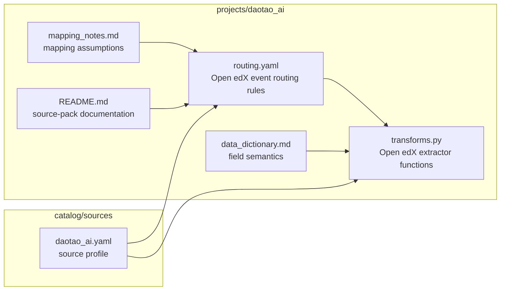

### Folder/File Trong Source Pack

```text
projects/daotao_ai/
├── routing.yaml              # Cô lập semantics route đặc thù Open edX
├── transforms.py             # Cô lập logic bóc field mà core không nên biết
├── mapping_notes.md          # Giữ assumption để mapping không trở thành tri thức ngầm
├── data_dictionary.md        # Nối schema kỹ thuật với ý nghĩa nghiệp vụ
├── README.md                 # Định vị vai trò source pack trong toàn framework
└── __init__.py               # Đánh dấu source pack như một module cắm vào core

catalog/sources/
└── daotao_ai.yaml            # Tuyên bố cách source này được framework nạp và chạy
```

### Giải thích Layer 2

Layer này là phần `dataset-specific` hoặc `source-specific`.

Đối với `daotao_ai`, đây là source pack đầu tiên để chứng minh framework chạy được với Open edX tracking logs.

Ý nghĩa của layer này là:

1. Cô lập tri thức đặc thù của từng nguồn dữ liệu
2. Bảo vệ framework core khỏi bị cài cắm logic use-case
3. Cho phép thêm source mới bằng cách cắm pack mới thay vì sửa lõi

Ví dụ:

- `problem_check`
- `problem_graded`
- `edx.grades.problem.submitted`
- `play_video`
- `textbook.pdf.page.scrolled`

Những event này không được viết trong `src/learnlake`. Chúng chỉ được tồn tại trong source pack.

Điểm cần nhấn mạnh trong slide:

- Source pack là nơi “dịch” semantics của nguồn dữ liệu sang ontology chung của framework.
- Nếu sau này thêm Moodle, xAPI, EdNet thì chỉ cần thêm source pack mới.

## 3.1 Source Pack Ở Mức Folder

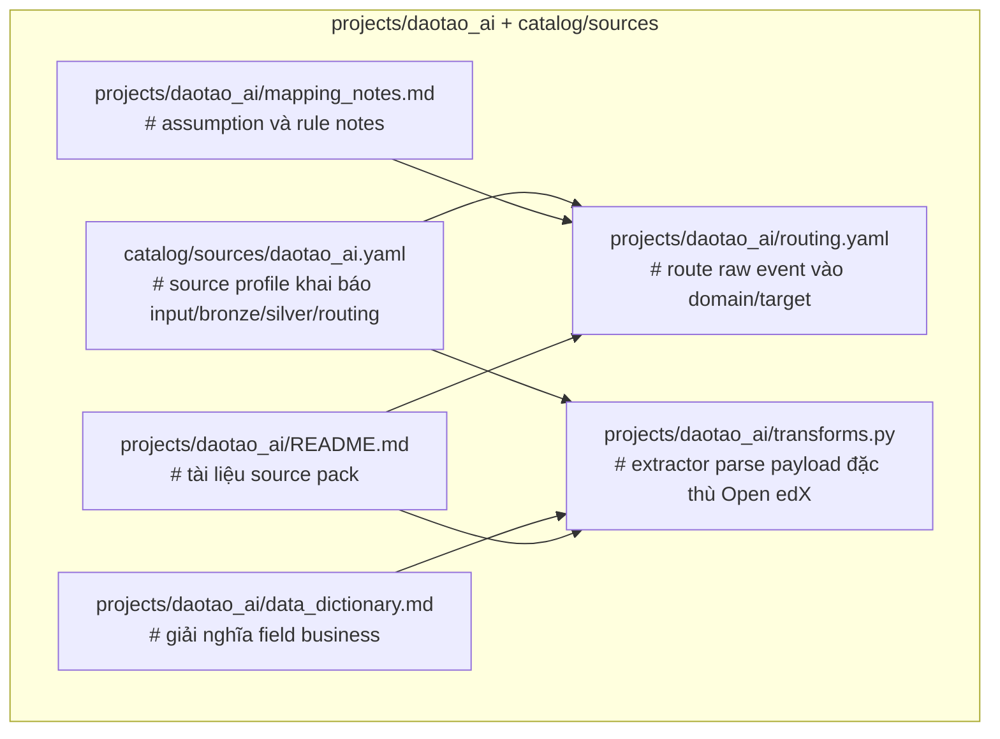

## 3.2 Logic Bên Trong Source Pack

Source pack không phải chỉ là “một đống rule riêng cho dataset”.

Nó có trách nhiệm rất rõ:

### a. `daotao_ai.yaml` là source profile

File này mô tả một source cần gì để framework chạy được:

- input mode là gì
- Bronze path là gì
- `events_canonical` nằm đâu
- `silver_unknown_events` và `silver_invalid_events` nằm đâu
- các bảng domain Silver nào được bật
- mỗi bảng ghi vào path nào
- routing file nào sẽ được dùng
- parser file nào sẽ được dùng
- quality rules nào sẽ được áp dụng

Nói ngắn gọn:

> source profile là bản khai báo cấu hình của source.

### b. `routing.yaml` là semantic classifier

File này chứa các luật route có priority.

Nó quyết định:

- event thuộc `assessment`, `video`, `document`, `navigation`, `exam`, `auth`, `system`, hay `unknown`
- event cần đi vào table nào
- extractor nào sẽ được gọi

Điểm quan trọng:

- cùng một path `/courses/...` không đủ để quyết định domain
- priority route phải xử lý các case chồng lấn
- ví dụ `problem_check` phải thắng generic course route

### c. `parsers.yaml` + parser functions là semantic extractor surface

Nếu `routing.yaml` trả lời câu hỏi:

> “event này thuộc loại nào?”

thì parser config và parser functions trả lời câu hỏi:

> “event này cần bóc những field typed nào?”

Ví dụ:

- assessment:
  - `problem_id`
  - `grade`
  - `max_grade`
  - `attempts`
- video:
  - `video_id`
  - `current_time_seconds`
  - `new_speed`
- document:
  - `page_number`
  - `zoom_amount`
  - `scroll_direction`
- exam:
  - `exam_id`
  - `attempt_status`

### d. Tài liệu đi kèm source pack

`mapping_notes.md`, `data_dictionary.md`, `README.md` không chỉ là doc phụ.

Chúng giúp:

- giải thích assumption mapping
- ghi lại edge cases
- giúp người khác hiểu semantics của source mà không phải đọc hết code

### Câu chốt cho layer này

> Source pack là lớp chuyển đổi từ raw semantics của một hệ thống học tập cụ thể sang ontology chung của LearnLake, hoàn toàn tách khỏi framework core.

## 4. Layer 3: Runtime Adapter

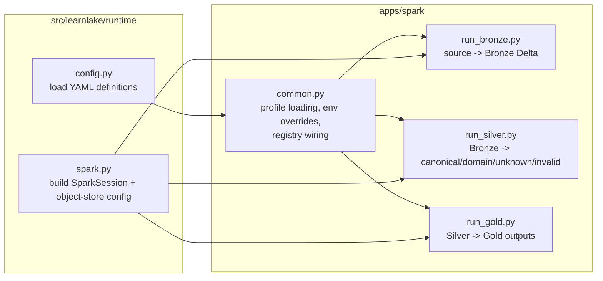

### Folder/File Trong Runtime Adapter

```text
apps/spark/
├── run_bronze.py             # Biến ingest contract thành job chạy thực tế
├── run_silver.py             # Biến Silver contract thành single streaming job thực tế
├── run_gold.py               # Nối Silver typed data sang lớp aggregate/feature
├── common.py                 # Gom wiring runtime để runner không tự biết quá nhiều
└── __init__.py               # Định danh adapter Spark như một module chạy được

src/learnlake/runtime/
├── config.py                 # Biến YAML declarations thành runtime objects
└── spark.py                  # Gói dependency Spark/object store thành backend adapter
```

### Giải thích Layer 3

`Runtime Adapter` là lớp thực thi framework trên một backend cụ thể.

Hiện tại backend là Spark.

Ý nghĩa của layer này là:

1. Tách “cách chạy” ra khỏi “cách hiểu dữ liệu”
2. Giữ Spark là backend hiện tại chứ không biến nó thành framework core
3. Giảm chi phí đổi backend trong tương lai nếu cần

Luồng trong layer này:

1. `run_bronze.py` đọc input và ghi Bronze
2. `run_silver.py` đọc Bronze và chạy single Spark-first Silver runtime
3. `run_gold.py` đọc Silver để tạo metric/aggregate

Điểm cần nhấn mạnh trong slide:

- Runtime adapter chịu trách nhiệm “chạy”.
- Framework core chịu trách nhiệm “hiểu dữ liệu”.

## 4.1 Runtime Adapter Ở Mức Folder

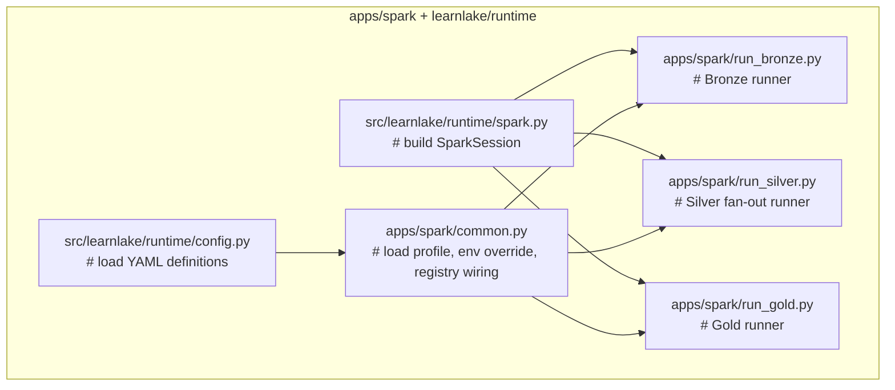

## 4.2 Logic Bên Trong Runtime Adapter

### a. `run_bronze.py`

Đây là entrypoint ingest thực tế.

Nó làm:

1. đọc input từ Kafka hoặc file
2. dựng Bronze envelope
3. ghi Bronze Delta

Ý nghĩa:

- Bronze là tầng raw nhưng có lineage chuẩn
- runtime runner này chịu trách nhiệm đưa source data vào form Bronze thống nhất

### b. `run_silver.py`

Đây là runner quan trọng nhất ở giai đoạn Silver.

Nó làm:

1. đọc Bronze Delta
2. load source profile, routing, parsers, quality rules
3. compile config thành Spark plan ở driver
4. chạy shared transforms và route classification trên worker
5. build `events_canonical`, domain tables, `silver_unknown_events`, `silver_invalid_events`
6. ghi output Delta theo từng target

Điểm quan trọng:

- Silver không còn có batch mode hoặc legacy stream mode
- hot path dùng Spark DataFrame expressions chứ không dùng Python row iteration

### c. `common.py`

Đây là glue code của runtime.

Nó làm:

- load source profile
- apply env override
- load route set và mapping spec
- load quality rules
- build registry từ source pack

Ý nghĩa:

- tách cấu hình runtime ra khỏi logic business của từng runner

### d. `runtime/spark.py`

Phần này xây `SparkSession`.

Nó không chứa logic học tập hay Open edX.

Nó chỉ:

- setup Spark app
- nạp object-store config
- đọc env generic kiểu `AWS_*`, `OBJECT_STORE_*`

### Câu chốt cho layer này

> Runtime Adapter là nơi biến framework semantics thành Spark jobs chạy được, nhưng không mang logic dataset-specific.

## 5. Layer 4: Platform / Infrastructure

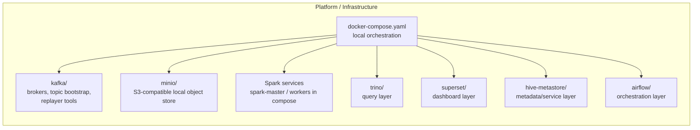

### Folder/File Trong Platform Layer

```text
docker-compose.yaml           # Gói toàn bộ local platform thành một điểm khởi động

kafka/
├── scripts/                  # Tự bootstrap topic thay vì yêu cầu thao tác tay
├── src/producers/            # Chứa tool ingest/replay phục vụ local end-to-end
└── Dockerfile                # Đóng gói broker runtime nhất quán cho local stack

minio/
└── Dockerfile                # Cung cấp object store local tương thích S3

Spark services
  spark-master / spark-worker-1 / spark-worker-2
  # Cung cấp execution environment để runner thực sự chạy được

trino/
├── bootstrap/                # Khởi tạo query layer tự động
└── views/                    # Chứa serving/view logic downstream

superset/
├── bootstrap/                # Tự dựng dashboard layer trong local stack
└── Dockerfile                # Đóng gói BI runtime cục bộ

hive-metastore/
└── Dockerfile                # Giữ metadata/query services chạy đồng nhất

airflow/
├── dags/                     # Đặt orchestration ở ngoài core processing logic
├── tasks/                    # Tách wrapper chạy job khỏi business logic
├── utils/                    # Gom helper orchestration dùng chung
└── Dockerfile                # Đóng gói orchestration runtime
```

### Giải thích Layer 4

Đây là layer phục vụ triển khai và chạy hệ thống.

Ý nghĩa của layer này là:

1. Cung cấp môi trường chạy end-to-end có thể dựng lại được
2. Tách concerns hạ tầng khỏi concerns semantic của framework
3. Cho phép kiểm thử local mà không cần bootstrap thủ công

Điểm cần nhấn mạnh trong slide:

- Đây là môi trường chạy framework, không phải framework bản thân nó.
- V1 của framework vẫn đang reuse platform layer này thay vì tách nó thành platform-agnostic deployment module.

## 5.1 Platform Layer Ở Mức Folder/Service

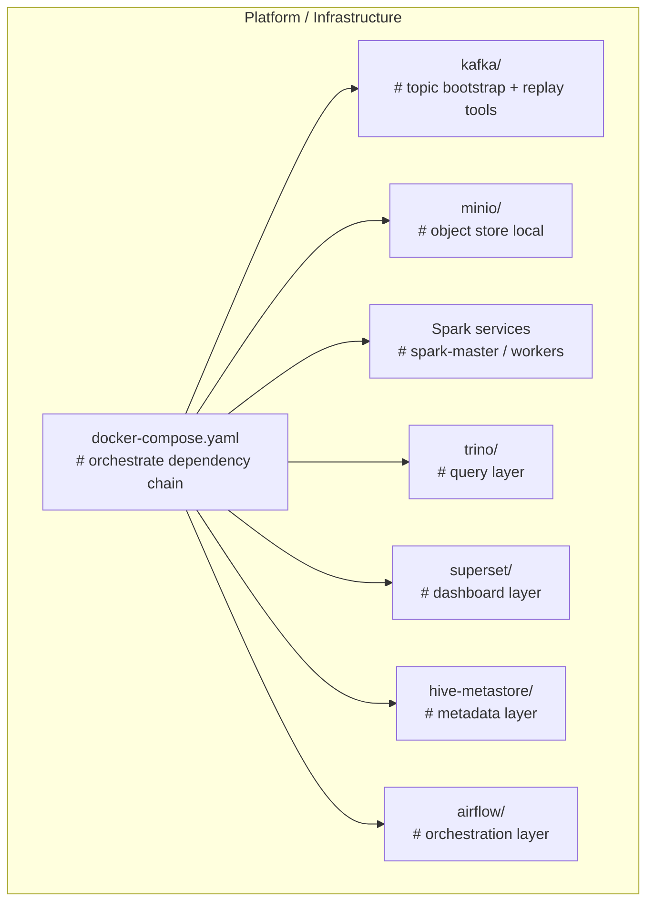

## 5.2 Logic Bên Trong Platform Layer

### a. `docker-compose.yaml`

Đây là entrypoint của local platform.

Nó làm:

- dựng broker
- dựng MinIO
- dựng Spark master/worker
- dựng Bronze/Silver stream services
- chạy init services như `kafka-init`, `minio-init`

### b. `kafka/`

Trong hướng mới, `kafka/` được xem là platform support:

- bootstrap topic
- giữ producer tools như `tracking_log_replayer`
- hỗ trợ local ingest

Nó không phải source-agnostic framework core.

### c. `minio/`

Đây là object store local kiểu S3-compatible.

Nó giữ:

- Bronze Delta
- Silver Delta
- Gold outputs
- checkpoint paths

### d. Spark services

Ở hướng mới, phần cần nói là Spark cluster service:

- `spark-master`
- `spark-worker-*`

Chúng là execution environment cho `apps/spark/*`.

Không cần đưa các folder legacy Spark cũ vào slide kiến trúc mới.

### e. `trino/`, `superset/`, `hive-metastore/`

Đây là serving/query layer:

- Trino: query engine
- Superset: dashboard
- Hive Metastore: metadata support

V1 của framework chưa tập trung vào lớp này, nhưng platform local vẫn giữ để demo full pipeline.

### f. `airflow/`

Đây là orchestration layer:

- useful cho scheduling
- useful cho production-like orchestration

Nhưng nó không phải nơi chứa normalize logic.

### Câu chốt cho layer này

> Platform Layer là môi trường để dựng và chạy hệ thống end-to-end. Nó hỗ trợ framework, nhưng không định nghĩa contract hay semantics dữ liệu.

## 6. Data Flow Từ `daotao_ai` Qua Framework

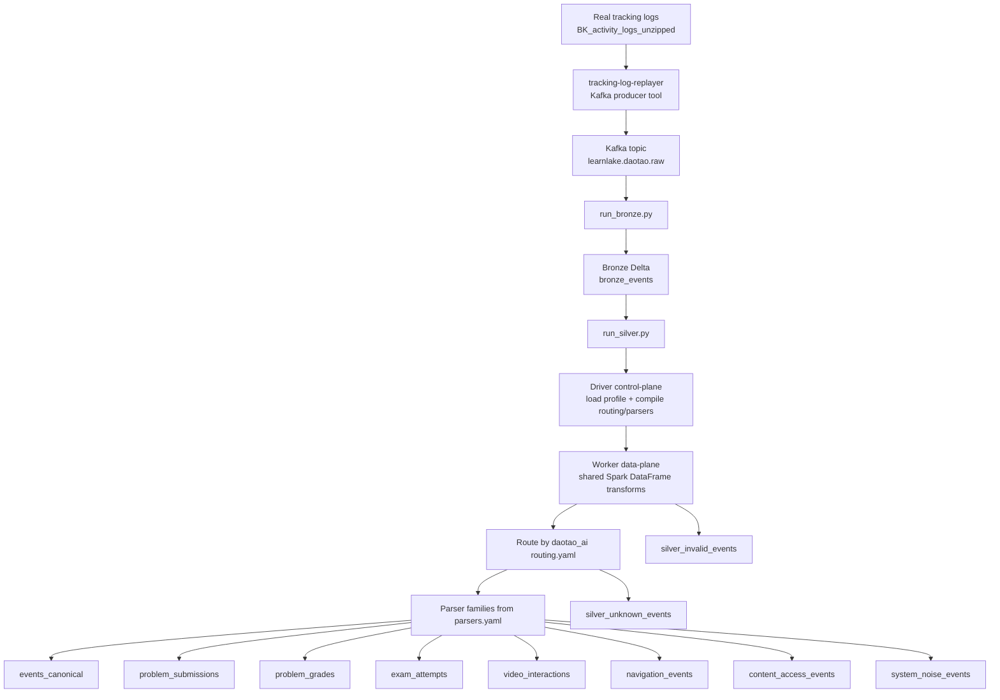

### Ý nghĩa data flow

- `tracking-log-replayer` chỉ là tool bơm dữ liệu vào Kafka cho local test.
- `Bronze` giữ raw lineage.
- `Silver` là bước hiểu ngữ nghĩa source và fan-out thành domain tables.
- `daotao_ai` source pack quyết định event đi vào domain nào.

## 7. Thông Điệp Chính Để Nói Trong Slide

### Slide 1: Full architecture

Thông điệp:

- Hệ thống được chia 4 lớp rõ ràng.
- Framework core và source pack là phần semantic.
- Runtime và platform là phần thực thi.

### Slide 2: Framework Core

Thông điệp:

- Đây là lõi tái sử dụng được cho nhiều nguồn dữ liệu.
- Core chỉ hiểu contracts, routing, normalization, validation.
- Core không hiểu semantics Open edX cụ thể.

### Slide 3: Source Pack `daotao_ai`

Thông điệp:

- Đây là lớp chứa toàn bộ logic đặc thù Open edX.
- Nó map raw source events sang ontology chung của LearnLake.
- Có thể thay bằng source pack khác mà không sửa framework core.

### Slide 4: Runtime Adapter

Thông điệp:

- Spark chỉ là backend thực thi hiện tại.
- Runtime adapter chịu trách nhiệm chạy Bronze/Silver/Gold.
- Có thể coi đây là lớp “execution engine integration”.

### Slide 5: Platform / Infrastructure

Thông điệp:

- Đây là môi trường dựng local end-to-end.
- Kafka, MinIO, Spark cluster, Trino, Superset, Airflow không phải logic framework.
- Chúng là lớp phục vụ triển khai, kiểm thử và demo.

## 8. Một Câu Kết Ngắn Gọn Cho Slide

> LearnLake được thiết kế theo mô hình `framework core + source pack + runtime adapter + platform layer`. `src/learnlake` giữ toàn bộ logic generic, `projects/daotao_ai` giữ semantics của Open edX tracking logs, `apps/spark` thực thi pipeline Bronze/Silver/Gold, còn Kafka/MinIO/Spark/Trino/Superset/Airflow là lớp hạ tầng để chạy và kiểm thử hệ thống.
