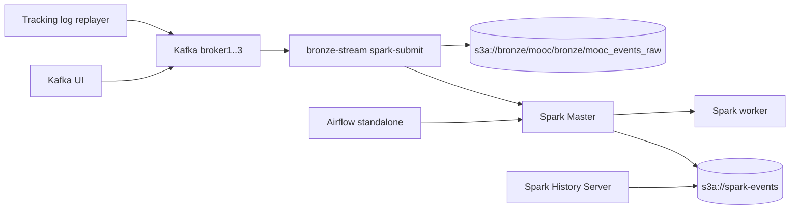

# Runbook

## Architecture



## Runtime Versions

- Spark/PySpark: `3.5.1` runtime with Scala `2.12`.
- Delta Lake: `io.delta:delta-spark_2.12:3.2.0`.
- Kafka connector: `org.apache.spark:spark-sql-kafka-0-10_2.12:3.5.1`.
- S3A: `org.apache.hadoop:hadoop-aws:3.3.4`.
- AWS SDK bundle: `com.amazonaws:aws-java-sdk-bundle:1.12.262`.

## Start Full Stack

```bash
cd source
docker compose up -d --build
```

Default mode starts Kafka, Kafka UI, MinIO, Spark Master/Worker, History Server, Airflow, and Bronze stream. Optional replay is behind the `replay` profile:

```bash
docker compose --profile replay up -d tracking-log-replayer
```

Do not run production streams with `python -m apps.*`; the stack submits Bronze with `spark-submit --master spark://spark-master:7077`.

## Services And UIs

- Spark Master UI: `http://localhost:8081`
- Spark Worker 1 UI: `http://localhost:8082`
- Kafka UI: `http://localhost:8085`
- Spark History Server: `http://localhost:18080`
- Airflow UI: `http://localhost:8089`
- MinIO Console: `http://localhost:9001`

## Streaming Jobs

| Kafka topic | Spark service | Delta table | Checkpoint |
| --- | --- | --- | --- |
| `mooc.raw.events` | `bronze-stream` | `s3a://bronze/mooc/bronze/mooc_events_raw` | `s3a://checkpoints/mooc/bronze_ingestor` |

Never delete checkpoint paths during normal restart. Structured Streaming uses them for exactly-once progress and state recovery.

## Restart Or Submit Streams

```bash
cd source
docker compose restart bronze-stream
docker compose logs -f bronze-stream
```

Manual submit for debugging:

```bash
docker compose exec -T spark-master \
  /opt/bitnami/spark/bin/spark-submit --master spark://spark-master:7077 \
  --conf spark.executorEnv.PYTHONPATH=/opt/project/spark \
  /opt/project/spark/apps/bronze_ingestor/main.py
```

## Airflow Maintenance

Airflow only schedules health checks and Bronze maintenance. It does not own long-running stream lifecycles.

```bash
cd source
docker compose exec airflow \
  airflow dags trigger bronze_table_maintenance
```

The maintenance DAG calls `spark-submit` for `spark/apps/maintenance/delta_maintenance.py`. Default `OPTIMIZE` is on and `VACUUM` is off unless enabled by env.

## Smoke Validation

```bash
cd source
deploy/scripts/smoke_spark_standalone.sh
```

Manual checklist:

1. Spark Master is reachable and at least one worker is registered.
2. A `spark-submit --master spark://spark-master:7077` smoke app appears on Spark Master UI.
3. Spark writes and reads `s3a://bronze/smoke/spark_standalone_delta`.
4. Spark writes and reads that smoke path as Delta.
5. Kafka sample event is produced to `mooc.raw.events`.
6. Bronze checkpoint appears under `s3a://checkpoints/mooc/bronze_ingestor`.
7. Airflow `bronze_table_maintenance` succeeds through Spark Standalone.
8. Spark event logs appear in `s3a://spark-events/logs` and are visible in History Server.

## Send Data To Kafka

### Real data — BK_activity_logs_unzipped

```bash
cd source
docker compose --profile replay up -d tracking-log-replayer
docker compose logs -f tracking-log-replayer
```

Mặc định replay 2 file đầu ở tốc độ 4x. Để thay đổi tham số:

```bash
docker compose run --rm --profile replay tracking-log-replayer \
  python -m kafka.src.producers.tracking_log_replayer \
  --brokers broker1:29092,broker2:29092,broker3:29092 \
  --input-root /data/activity_logs \
  --topic mooc.raw.events \
  --anonymous-topic mooc.raw.anonymous.events \
  --max-files 20 \
  --speed 10
```

### Fake data — smoke test nhanh

Gửi JSON hợp lệ:

```bash
docker exec -i lsp-broker1 kafka-console-producer \
  --bootstrap-server broker1:29092 \
  --topic mooc.raw.events \
  --property "parse.key=true" \
  --property "key.separator=:" << 'EOF'
user_001:{"event_type":"play_video","username":"alice","course_id":"CS101","video_id":"v001","time":"2026-05-06T09:00:00Z","currentTime":0,"duration":600}
user_002:{"event_type":"pause_video","username":"bob","course_id":"CS101","video_id":"v001","time":"2026-05-06T09:00:05Z","currentTime":120,"duration":600}
user_003:{"event_type":"problem_check","username":"carol","course_id":"CS202","problem_id":"p001","time":"2026-05-06T09:00:10Z","success":true}
EOF
```

Gửi message không hợp lệ (để test nhánh `parse_status = invalid_json`):

```bash
docker exec -i lsp-broker1 kafka-console-producer \
  --bootstrap-server broker1:29092 \
  --topic mooc.raw.events << 'EOF'
THIS IS NOT JSON
EOF
```

## Verify Bronze Delta

Kiểm tra file đã ghi vào MinIO:

```bash
docker exec lsp-minio sh -c "
  mc alias set local http://minio:9000 minio minio123456 --quiet 2>/dev/null
  mc ls --recursive local/bronze/mooc/bronze/mooc_events_raw/
"
```

Kiểm tra checkpoint tiến triển:

```bash
docker exec lsp-minio sh -c "
  mc alias set local http://minio:9000 minio minio123456 --quiet 2>/dev/null
  mc ls local/checkpoints/mooc/bronze_ingestor/offsets/
  mc ls local/checkpoints/mooc/bronze_ingestor/commits/
"
```

## Stop Stack

```bash
cd source
docker compose down
```

Use `down -v` only when intentionally wiping Kafka data, MinIO buckets, Airflow metadata, and all checkpoints.
