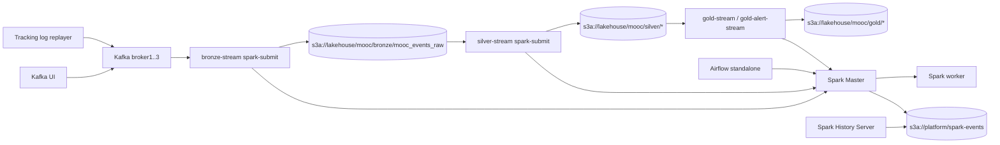

# Runbook

## Architecture



## Runtime Versions

- Spark/PySpark: `3.5.1` runtime with Scala `2.12`.
- Delta Lake: `io.delta:delta-spark_2.12:3.2.0`.
- Kafka connector: `org.apache.spark:spark-sql-kafka-0-10_2.12:3.5.1`.
- S3A: `org.apache.hadoop:hadoop-aws:3.3.4`.
- AWS SDK bundle: `com.amazonaws:aws-java-sdk-bundle:1.12.262`.

## Start Full Stack

```bash
cd source
docker compose up -d --build
```

Default mode starts Kafka, Kafka UI, MinIO, Hive Metastore, Trino, Superset, Spark Master/Worker, History Server, Airflow, Bronze stream, Silver stream, Gold stream, Gold alert stream, and the replay service. The stack now includes the query/dashboard layer in the same compose file:

```bash
docker compose up -d bronze-stream silver-stream tracking-log-replayer spark-master spark-worker-1
```

Compose will auto-start the required dependencies for that subset: Kafka brokers, `kafka-init`, MinIO, and `minio-init`. The bootstrap steps run inside containers, so the normal path does not require manual `mc` or topic-creation commands.

Do not run production streams with `python -m apps.*`; the stack submits LearnLake Bronze/Silver with `spark-submit --master spark://spark-master:7077`.

## Services And UIs

- Spark Master UI: `http://localhost:8081`
- Spark Worker 1 UI: `http://localhost:8082`
- Spark Worker 2 UI: `http://localhost:8083`
- Bronze Spark Driver UI: `http://localhost:4040`
- Silver Spark Driver UI: `http://localhost:4041`
- Gold Spark Driver UI: `http://localhost:4042`
- Gold Alert Spark Driver UI: `http://localhost:4043`
- Kafka UI: `http://localhost:8085`
- Spark History Server: `http://localhost:18080`
- Airflow UI: `http://localhost:8089`
- MinIO Console: `http://localhost:9001`
- Trino: `http://localhost:8080`
- Superset: `http://localhost:8088`

The full stack now includes the query/dashboard layer. Trino is available at `http://localhost:8080` and Superset at `http://localhost:8088`.

## Streaming Jobs

| Source | Spark service | Delta table | Checkpoint |
| --- | --- | --- | --- |
| `mooc.raw.events` | `bronze-stream` | `s3a://lakehouse/mooc/bronze/mooc_events_raw` | `s3a://platform/mooc/bronze_ingestor` |
| `s3a://lakehouse/mooc/bronze/mooc_events_raw` | `silver-stream` | `s3a://lakehouse/learnlake/silver/*` | `s3a://platform/learnlake/checkpoints/silver/daotao_ai` |
| `s3a://lakehouse/mooc/silver/*` | `gold-stream` | `s3a://lakehouse/mooc/gold/*` | `s3a://platform/mooc/gold_aggregator` |
| `s3a://lakehouse/mooc/gold/behavior_anomaly_signals` | `gold-alert-stream` | `s3a://lakehouse/mooc/gold/anomaly_alerts` | `s3a://platform/mooc/gold_alerting` |

Gold tables are written straight to MinIO and remain available for downstream consumers.

Never delete checkpoint paths during normal restart. Structured Streaming uses them for exactly-once progress and state recovery.
Kafka UI is still useful for topic and broker visibility, but Bronze stream progress is best observed in Spark Driver UI and the checkpoint path, not by expecting a stable consumer group entry.

For live performance checks, open the driver UI that matches the app you want to inspect. The `Structured Streaming` tab shows query progress, while `Jobs`, `Stages`, and `Executors` let you inspect micro-batch task scheduling and runtime.

## Restart Or Submit Streams

```bash
cd source
docker compose restart bronze-stream
docker compose logs -f bronze-stream
```

Manual submit for debugging:

```bash
docker compose exec -T spark-master \
  /opt/bitnami/spark/bin/spark-submit --master spark://spark-master:7077 \
  --conf spark.executorEnv.PYTHONPATH=/opt/project/src:/opt/project \
  /opt/project/apps/spark/run_bronze.py --source daotao_ai
```

## Airflow Maintenance

Airflow only schedules health checks and Bronze maintenance. It does not own long-running stream lifecycles.

```bash
cd source
docker compose exec airflow \
  airflow dags trigger bronze_table_maintenance
```

The maintenance DAG calls `spark-submit` for `apps/maintenance/delta_maintenance.py`. Default `OPTIMIZE` is on and `VACUUM` is off unless enabled by env.

## Smoke Validation

```bash
cd source
platform/local/scripts/scripts/smoke_spark_standalone.sh
```

Manual checklist:

1. Spark Master is reachable and at least one worker is registered.
2. A `spark-submit --master spark://spark-master:7077` smoke app appears on Spark Master UI.
3. Spark writes and reads `s3a://lakehouse/smoke/spark_standalone_delta`.
4. Spark writes and reads that smoke path as Delta.
5. Kafka sample event is produced to `mooc.raw.events`.
6. Bronze checkpoint appears under `s3a://platform/mooc/bronze_ingestor`.
7. Airflow `bronze_table_maintenance` succeeds through Spark Standalone.
8. Spark event logs appear in `s3a://platform/spark-events/logs` and are visible in History Server.

## Send Data To Kafka

### Real data — BK_activity_logs_unzipped

```bash
cd source
docker compose up -d tracking-log-replayer
docker compose logs -f tracking-log-replayer
```

Mặc định replay toàn bộ file ở tốc độ 100x. Để thay đổi tham số:

```bash
docker compose run --rm tracking-log-replayer \
  /opt/bitnami/python/bin/python apps/replay/replay_to_kafka.py \
  --source daotao_ai \
  --brokers broker1:29092,broker2:29092,broker3:29092 \
  --input /data/activity_logs \
  --topic ${LEARNLAKE_RAW_TOPIC:-learnlake.daotao.raw} \
  --speed 100
```

### Fake data — smoke test nhanh

Gửi JSON hợp lệ:

```bash
docker exec -i lsp-broker1 kafka-console-producer \
  --bootstrap-server broker1:29092 \
  --topic mooc.raw.events \
  --property "parse.key=true" \
  --property "key.separator=:" << 'EOF'
user_001:{"event_type":"play_video","username":"alice","course_id":"CS101","video_id":"v001","time":"2026-05-06T09:00:00Z","currentTime":0,"duration":600}
user_002:{"event_type":"pause_video","username":"bob","course_id":"CS101","video_id":"v001","time":"2026-05-06T09:00:05Z","currentTime":120,"duration":600}
user_003:{"event_type":"problem_check","username":"carol","course_id":"CS202","problem_id":"p001","time":"2026-05-06T09:00:10Z","success":true}
EOF
```

Gửi message không hợp lệ (để test nhánh `parse_status = invalid_json`):

```bash
docker exec -i lsp-broker1 kafka-console-producer \
  --bootstrap-server broker1:29092 \
  --topic mooc.raw.events << 'EOF'
THIS IS NOT JSON
EOF
```

## Verify Bronze Delta

Kiểm tra file đã ghi vào MinIO:

```bash
docker exec lsp-minio sh -c "
  mc alias set local http://minio:9000 minio minio123456 --quiet 2>/dev/null
  mc ls --recursive local/lakehouse/mooc/bronze/mooc_events_raw/
"
```

Kiểm tra checkpoint tiến triển:

```bash
docker exec lsp-minio sh -c "
  mc alias set local http://minio:9000 minio minio123456 --quiet 2>/dev/null
  mc ls local/platform/mooc/bronze_ingestor/offsets/
  mc ls local/platform/mooc/bronze_ingestor/commits/
"
```

## Stop Stack

```bash
cd source
docker compose down
```

Use `down -v` only when intentionally wiping Kafka data, MinIO buckets, Airflow metadata, and all checkpoints.
