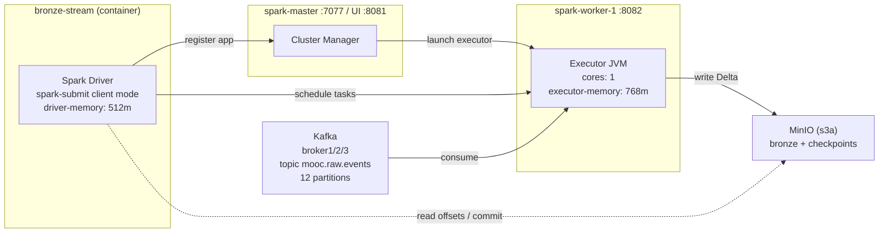
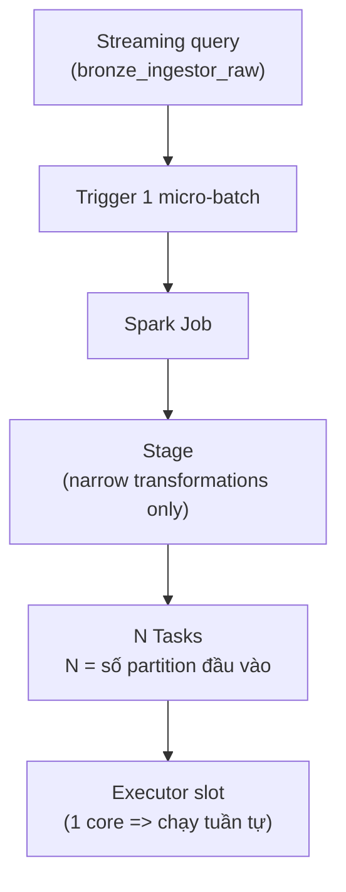
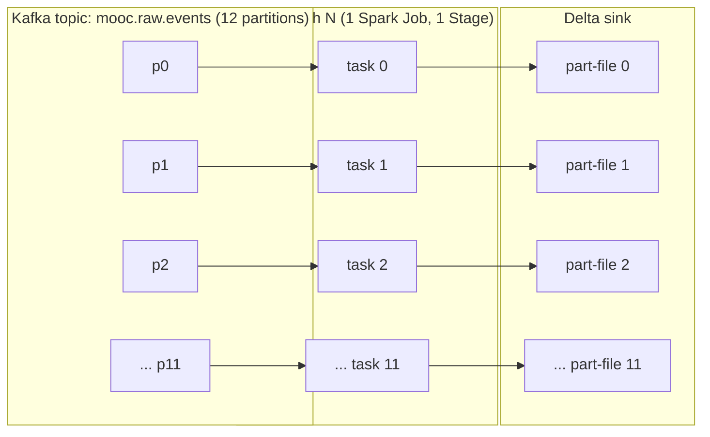

# Spark Cluster: Cơ chế chia Job/Task và Hướng dẫn Test Bronze Pipeline

Tài liệu này giải thích chi tiết cách Spark cluster chia một streaming job thành các đơn vị thực thi (Job/Stage/Task) trong dự án này, và hướng dẫn test bronze pipeline đầu cuối.

---

## 1. Topology cluster local

Cluster trong `docker-compose.yaml` chỉ có 1 master + 1 worker, chạy ở chế độ Spark Standalone:



Các tham số quan trọng (lấy từ `docker-compose.yaml` và `spark/conf/spark-defaults.conf`):

| Tham số | Giá trị | Ý nghĩa |
|---|---|---|
| `SPARK_MASTER_URL` | `spark://spark-master:7077` | Driver đăng ký app với master này |
| `SPARK_WORKER_CORES` | `1` | Số core worker dành cho executor |
| `SPARK_WORKER_MEMORY` | `1g` | RAM tối đa cho mọi executor trên worker |
| `SPARK_DRIVER_MEMORY` | `512m` | RAM driver |
| `SPARK_EXECUTOR_MEMORY` | `768m` | RAM mỗi executor |
| `spark.sql.shuffle.partitions` | `200` | Mặc định khi có shuffle (bronze không shuffle nên không dùng) |
| `spark.sql.adaptive.enabled` | `true` | AQE: gộp partition shuffle khi runtime |

`bronze-stream` chạy `spark-submit --deploy-mode client`, nên driver process nằm ngay trong container đó, executor mới được phát động ở `spark-worker-1`.

---

## 2. Spark chia work thành Job / Stage / Task như thế nào

### 2.1 Mô hình chung

Trong Spark Structured Streaming, mỗi lần chạy một micro-batch sẽ tạo ra một (hoặc một vài) Spark Job. Mỗi Job được chia thành nhiều Stage theo ranh giới shuffle, mỗi Stage chia thành Task theo số partition.



Quy tắc:
- **Job**: tạo bởi mỗi action (ở đây action là sink `writeStream` mỗi micro-batch).
- **Stage**: phần pipeline chỉ chứa narrow transformations (map, filter, project). Khi gặp wide transformation (join, groupBy, repartition) thì cắt stage mới.
- **Task**: 1 partition đầu vào của stage = 1 task. Task là đơn vị nhỏ nhất gửi tới executor.

### 2.2 Áp dụng vào bronze pipeline

Pipeline bronze trong `spark/apps/bronze_ingestor/job.py`:

```text
read_kafka_stream
  -> enrich_bronze   (select/withColumn/sha2)        narrow
  -> parse_status    (from_json/withColumn/drop)     narrow
  -> writeStream Delta (sink)
```

Tất cả là narrow transformations + 1 sink. Vì vậy mỗi micro-batch:

- Sinh 1 Job.
- Job có 1 Stage (không shuffle).
- Số task của stage = số partition Kafka mà micro-batch đó đọc.

Topic `mooc.raw.events` được tạo với 12 partition (xem `kafka/scripts/create_topics.sh`):

```text
create_topic "mooc.raw.events" 12 1209600000
```

Spark Kafka source (mặc định) ánh xạ 1 Kafka partition -> 1 Spark partition trong batch. Trong điều kiện đầy đủ dữ liệu, mỗi micro-batch sẽ có khoảng 12 task. Khi không có dữ liệu hoặc Spark gộp partition (config `minPartitions`), số task có thể nhỏ hơn.



### 2.3 Tính song song thực tế

Worker chỉ có 1 core (`SPARK_WORKER_CORES=1`), nên dù có 12 task trong một stage, executor chỉ chạy được 1 task tại mỗi thời điểm. 11 task còn lại nằm trong queue của TaskScheduler và lần lượt vào slot khi task trước hoàn thành.

Hệ quả:
- Throughput bị giới hạn bởi 1 core. Muốn tăng song song hãy tăng `SPARK_WORKER_CORES` hoặc thêm worker.
- Latency mỗi micro-batch xấp xỉ tổng thời gian của 12 task.
- Vì stage không shuffle, Spark không tạo thêm task ngoài số partition Kafka, kể cả khi `spark.sql.shuffle.partitions=200`.

### 2.4 Output ra Delta

`write_delta_stream` dùng `outputMode("append")` và `partitionBy("ingest_date","ingest_hour")`. Mỗi task sẽ:

1. Tạo writer cho path tương ứng (`s3a://bronze/.../ingest_date=YYYY-MM-DD/ingest_hour=HH/`).
2. Ghi 1 hoặc nhiều file `part-*.parquet`.
3. Driver commit 1 transaction Delta cho cả batch (file `_delta_log/000....json`).

Checkpoint trong `s3a://checkpoints/mooc/bronze_ingestor` chứa:
- `offsets/` (offset Kafka đã đọc cho mỗi batch),
- `commits/` (các batch đã commit thành công),
- `sources/` và `state/` (nếu có stateful op).

Đây là cơ chế đảm bảo exactly-once cho streaming.

### 2.5 Vai trò driver vs executor

| Thành phần | Việc làm cho bronze |
|---|---|
| Driver | Build SparkSession, plan logical/physical, gọi Kafka admin để biết offset range, sinh micro-batch, gửi task tới executor, commit Delta transaction, ghi checkpoint. |
| Executor | Chạy task: poll Kafka, tính UDF/expression, ghi parquet ra MinIO. |
| Master | Chỉ điều phối resource (executor đăng ký, heartbeat). Không tham gia execution. |

---

## 3. Hướng dẫn test bronze pipeline từng bước

### 3.1 Chuẩn bị

Bạn đã có:
- File compose `source/docker-compose.yaml`.
- Spark image bitnami 3.5 build sẵn.
- Topic Kafka `mooc.raw.events` được khởi tạo bởi `kafka-init` (`kafka/scripts/create_topics.sh`).
- Bucket MinIO `bronze`, `checkpoints`, `spark-events` được khởi tạo bởi `minio-init`.

Tất cả lệnh chạy ở thư mục `source/`.

### 3.2 Bước 1 - Bật cluster

```bash
cd source
docker compose up -d --build broker1 broker2 broker3 kafka-init minio minio-init spark-master spark-worker-1 spark-history-server bronze-stream
```

Đợi healthcheck:

```bash
docker compose ps
```

Cần thấy `lsp-broker1/2/3`, `lsp-minio`, `lsp-spark-master`, `lsp-spark-worker-1`, `lsp-bronze-stream` ở trạng thái `healthy`/`running`. `lsp-kafka-init` và `lsp-minio-init` sẽ ở trạng thái `exited (0)` (đã hoàn tất).

### 3.3 Bước 2 - Kiểm tra Spark đã đăng ký app

Mở Spark Master UI: <http://localhost:8081>

Cần thấy:
- Mục "Workers" có 1 worker (`worker-...`) với 1 core, 1 GB.
- Mục "Running Applications" có 1 app tên `bronze_ingestor` (do `BRONZE_APP_NAME`).
- Cột "Cores" của app phải khác 0 (executor đã được cấp).

Nếu app không xuất hiện, xem log driver:

```bash
docker logs -f lsp-bronze-stream
```

### 3.4 Bước 3 - Mở Spark Driver UI cho query đang chạy

Driver UI nằm trong container `lsp-bronze-stream`. Mặc định cổng `4040` không expose ra host, mở thêm bằng cách:

```bash
docker exec lsp-bronze-stream bash -lc "ss -ltn | grep 4040"
```

Cách đơn giản hơn: thêm `ports: ["4040:4040"]` vào service `bronze-stream` rồi `docker compose up -d bronze-stream` lại. Sau đó mở <http://localhost:4040>.

Trong Driver UI có:
- Tab "Streaming Query" hoặc "Structured Streaming": liệt kê query `bronze_ingestor_raw`, hiển thị batch id, input rows/second, processed rows/second, batch duration.
- Tab "Jobs": từng micro-batch là một Spark Job. Mở 1 Job sẽ thấy đúng 1 Stage, và số task = số partition Kafka đã đọc cho batch đó.
- Tab "Stages": cột "Tasks" chính là số partition đầu vào batch đó.
- Tab "Executors": phải có 1 executor đang `Active`, "Total Cores" = 1.

Đây là bằng chứng trực quan nhất cho phần mục 2.

### 3.5 Bước 4 - Đẩy dữ liệu vào Kafka

Bronze chạy `starting_offsets: latest` (xem `configs/app/bronze_ingestor.yaml`), nên phải có data mới sau khi app đã subscribe.

Cách 1, dùng replayer có sẵn (đọc `BK_activity_logs_unzipped`):

```bash
docker compose --profile replay up -d tracking-log-replayer
docker logs -f lsp-source-tracking-log-replayer-1
```

Cách 2, gửi tay 1 message:

```bash
docker exec -i lsp-broker1 bash -lc \
  'kafka-console-producer --bootstrap-server broker1:29092 --topic mooc.raw.events' <<EOF
{"event_type":"play_video","username":"alice","time":"2025-05-06T15:00:00Z"}
EOF
```

Quan sát Kafka UI tại <http://localhost:8085> để chắc chắn message đã vào topic.

### 3.6 Bước 5 - Quan sát Spark xử lý

Trên Driver UI (`:4040` -> Streaming Query):
- Cột "Input Rate" sẽ tăng > 0.
- Cột "Batch Duration" hiển thị thời gian của micro-batch gần nhất.
- Bấm vào tên query để xem detail từng batch (Source: Kafka offsets in/out, Sink: numOutputRows).

Trên tab Jobs/Stages:
- Mỗi batch không rỗng tạo 1 Job. Mở Stage để thấy task list, runtime, locality, executor.

### 3.7 Bước 6 - Xác minh dữ liệu Delta đã được ghi

Mở MinIO Console: <http://localhost:9001> (user `minio`, pass `minio123456`).

Vào bucket `bronze`, đường dẫn:

```text
mooc/bronze/mooc_events_raw/
  ingest_date=YYYY-MM-DD/
    ingest_hour=HH/
      part-00000-....parquet
  _delta_log/
    00000000000000000000.json
    00000000000000000001.json
```

Phải thấy:
- Ít nhất 1 file `part-*.parquet` đã có size > 0.
- File `_delta_log/0000...N.json` xuất hiện sau mỗi batch không rỗng.

Bucket `checkpoints` cần có:

```text
mooc/bronze_ingestor/
  offsets/0
  offsets/1
  ...
  commits/0
  commits/1
```

### 3.8 Bước 7 - Đọc lại Delta để khẳng định schema

Chạy 1 spark-shell tạm trong cùng cluster:

```bash
docker exec -it lsp-spark-master bash -lc \
  "/opt/bitnami/spark/bin/pyspark \
   --master spark://spark-master:7077 \
   --packages io.delta:delta-spark_2.12:3.2.0,org.apache.hadoop:hadoop-aws:3.3.4 \
   --conf spark.sql.extensions=io.delta.sql.DeltaSparkSessionExtension \
   --conf spark.sql.catalog.spark_catalog=org.apache.spark.sql.delta.catalog.DeltaCatalog \
   --conf spark.hadoop.fs.s3a.endpoint=http://minio:9000 \
   --conf spark.hadoop.fs.s3a.path.style.access=true \
   --conf spark.hadoop.fs.s3a.access.key=minio \
   --conf spark.hadoop.fs.s3a.secret.key=minio123456"
```

Trong shell:

```python
df = spark.read.format("delta").load("s3a://bronze/mooc/bronze/mooc_events_raw")
df.printSchema()
df.count()
df.groupBy("parse_status").count().show()
df.select("kafka_topic","kafka_partition","kafka_offset","ingest_date","ingest_hour").show(5, truncate=False)
```

Tiêu chí pass:
- `printSchema` khớp `BRONZE_MOOC_EVENTS_SCHEMA` trong `domain/schemas/bronze/mooc_bronze.py` (12 cột).
- `count()` > 0 và tăng dần khi bạn gửi thêm message.
- `parse_status` chỉ có 2 giá trị: `ok` cho JSON hợp lệ và `invalid_json` cho payload không phải JSON dạng `map<string,string>`.

### 3.9 Bước 8 - Test failure recovery (idempotency)

Để chứng minh checkpoint hoạt động:

```bash
docker compose restart bronze-stream
```

Sau khi container khởi động lại, vào MinIO console, mở `_delta_log/`: phải có file mới với version tăng tiếp, không có file trùng version. Trong driver log không có `Replaying` lỗi, query tiếp tục từ offset đã cam kết.

### 3.10 Bước 9 - Kiểm tra Spark History Server

Mở <http://localhost:18080>. Mỗi lần `bronze-stream` restart sẽ tạo 1 application entry (đang chạy thì hiển thị ở "Incomplete applications"). Bạn có thể xem chi tiết Job/Stage/Task của các batch đã chạy ngay cả khi driver kết thúc.

### 3.11 Bước 10 - Smoke test code (offline, không cần cluster)

Trong môi trường dev local (theo rule `environment-and-runner`):

```bash
cd source
source .venv/bin/activate
uv run pytest spark/tests -q
```

Test integration `spark/tests/integration/test_end_to_end_smoke.py` chạy bronze pipeline trên SparkSession local + Delta tạm trong tmp dir, không cần Kafka/MinIO. Pass test này nghĩa là logic enrich/parse vẫn đúng.

---

## 4. Checklist nhanh "pipeline có chạy không"

| Kiểm tra | Nơi xem | Tiêu chí pass |
|---|---|---|
| Kafka topic tồn tại | Kafka UI :8085 | `mooc.raw.events` có 12 partitions, leader đầy đủ |
| Bucket sẵn sàng | MinIO :9001 | Tồn tại `bronze`, `checkpoints`, `spark-events` |
| Worker đăng ký | Spark Master :8081 | 1 worker ALIVE, 1 core free |
| App đang chạy | Spark Master :8081 | App `bronze_ingestor` ở Running, có executor |
| Streaming query | Driver UI :4040 | Query `bronze_ingestor_raw` ở `ACTIVE`, batch id tăng |
| Có dữ liệu | Kafka UI / replayer log | Offset cuối topic > 0 |
| Bronze được ghi | MinIO bucket `bronze` | Có `part-*.parquet` + `_delta_log/*.json` |
| Checkpoint tiến triển | MinIO bucket `checkpoints` | `offsets/N` và `commits/N` tăng dần |
| Schema đúng | pyspark read delta | 12 cột khớp `BRONZE_MOOC_EVENTS_SCHEMA` |
| Idempotent | restart `bronze-stream` | Không trùng version `_delta_log`, không lỗi replay |

---

## 5. Tinh chỉnh khi muốn tăng song song

- Tăng song song trong cùng 1 worker: chỉnh `SPARK_WORKER_CORES=4` (và `SPARK_WORKER_MEMORY` đủ lớn để executor 768m vẫn chạy được). Sau đó restart `spark-worker-1`. Trong Driver UI sẽ thấy executor có 4 cores, 1 batch chạy song song tới 4 task.
- Thêm worker thứ 2: copy service `spark-worker-1` thành `spark-worker-2` trong compose, executor sẽ được driver phát động ở cả 2 worker.
- Ép số partition Kafka đầu vào batch: dùng `spark.readStream...option("minPartitions", "12")` (hữu ích khi 1 Kafka partition quá to và bạn muốn chia nhỏ).
- Ép số file đầu ra Delta: thêm `repartition(N, "ingest_date", "ingest_hour")` trước sink để tránh quá nhiều file nhỏ. Bước này tạo shuffle, sẽ sinh stage thứ 2 (200 task theo `spark.sql.shuffle.partitions`, hoặc ít hơn khi AQE bật).

---

## 6. Tham chiếu nhanh

| Mục | Đường dẫn |
|---|---|
| Driver entry | `spark/apps/bronze_ingestor/main.py` |
| Job pipeline | `spark/apps/bronze_ingestor/job.py` |
| Config loader | `spark/apps/bronze_ingestor/config.py` |
| Kafka source | `spark/infrastructure/kafka/reader.py` |
| Delta sink | `spark/infrastructure/storage/delta.py` |
| Enrich logic | `spark/domain/bronze/enricher.py` |
| Parse logic | `spark/domain/bronze/parser.py` |
| Schema | `spark/domain/schemas/bronze/mooc_bronze.py` |
| Spark defaults | `spark/conf/spark-defaults.conf` |
| Compose cluster | `docker-compose.yaml` |
| Kafka topic config | `kafka/scripts/create_topics.sh` |
